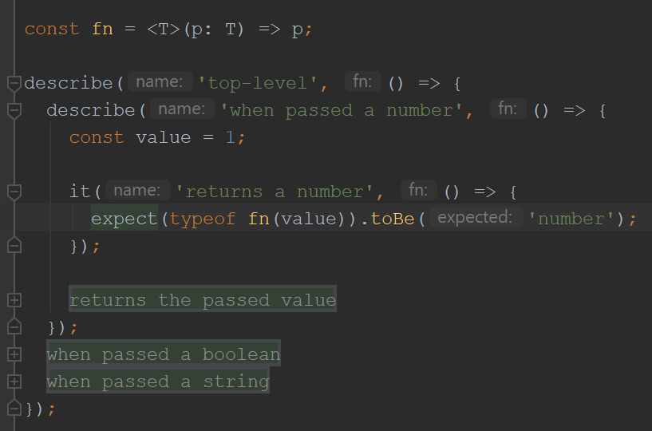

# fold-call-blocks plugin

IntelliJ plugin that lets you fold call blocks like region tags,
using the first argument of said call blocks as the placeholder text:

```
const fn = <T>(p: T) => p;

describe('top-level', () => {
  describe('when passed a number', () => {
    const value = 1;

    it('returns a number', () => {
      expect(typeof fn(value)).toBe('number');
    });

    it('returns the passed value', () => {
      expect(fn(value)).toBe(value);
    });
  });
  describe('when passed a boolean', () => {
    const value = true;

    it('returns a boolean', () => {
      expect(typeof fn(value)).toBe('boolean');
    });

    it('returns the passed value', () => {
      expect(fn(value)).toBe(value);
    });
  });
  describe('when passed a string', () => {
    const value = "hello world";

    it('returns a string', () => {
      expect(typeof fn(value)).toBe('string');
    });

    it('returns the passed value', () => {
      expect(fn(value)).toBe(value);
    });
  });
});
```


